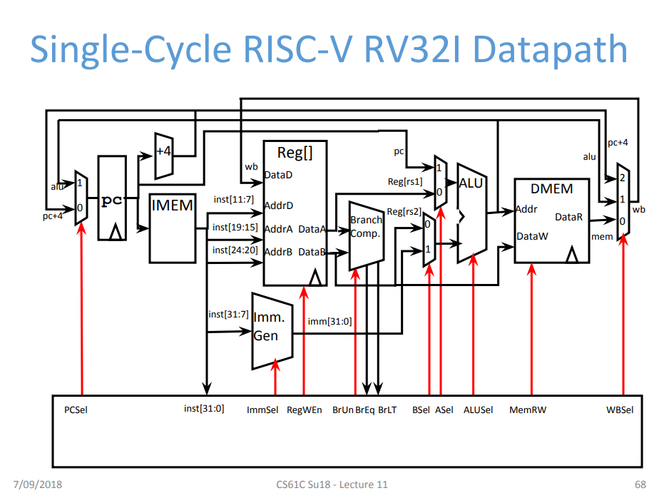

# RV32I_most_simple

[UCBの授業資料](https://inst.eecs.berkeley.edu/~cs61c/resources/su18_lec/Lecture11.pdf) のp68のデータパスを参考に作成した
RV32Iのすごく簡単なシングルサイクルデータパス。

# 実装言語

Chisel

# Verilogの生成

src/main/scala/Single_Cycle_Datapath/Main.scalaを実行